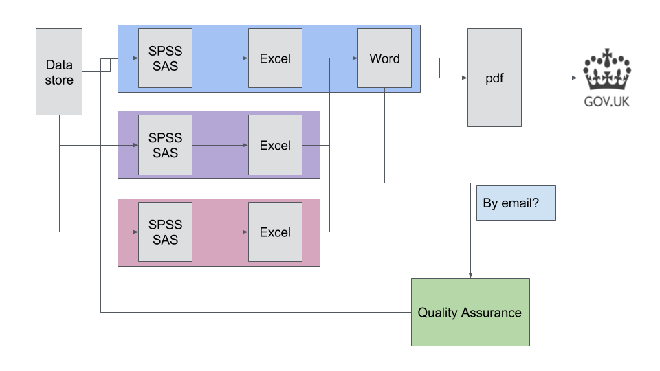

<style type="text/css" media="screen">
  img {
    display: block;
    margin-left: auto;
    margin-right: auto;
    width: 70%;
  }
</style>

The final exercise demonstrates the advantages of working reproducibly.

> You have discussed the report with your colleagues/manager/client.
>
> Disaster!  It has emerged that the cashflows for business lines 5 and 6 should not have been included in the analysis and the discount rate should have been 2.75% p.a.

If your workflow looked like this you would have to amend the analysis in Excel and manually update the Word document.

<a href="https://ukgovdatascience.github.io/rap_companion/why.html#the-current-statistics-production-process"></a>
*Image above from the [RAP Companion](https://ukgovdatascience.github.io/rap_companion/)*

Manual steps such as these are time consuming and can introduce errors.  What if you had updated the discount rate in the report but forgot to do so in the spreadsheet?  Would this get caught when the work was checked?

**Working reproducibly minimises the risk of these errors and allows changes to be made efficiently.**

## Update the analysis

In order to make the required changes:

* Replace line 2 of the `munge/01-A.R` script with `cashflows_to_use = rawcashflows[2:5]` to remove the cashflows for lines 5 and 6.  Note that we never edit the raw data!

* Change line 20 in the `src/analysis.R` script to `disc = 0.0275` to change the discount rate.

## Check your changes

Before creating the report, run your tests in the console

```R
> test.project()

Project name: cashflow_analysis
Loading project configuration
Autoloading packages
 Loading package: reshape2
 Loading package: plyr
 Loading package: tidyverse
 Loading package: stringr
 Loading package: lubridate
 Loading package: forecast
 Loading package: ggplot2
Autoloading helper functions
 Running helper script: globals.R
 Running helper script: helpers.R
Autoloading data
Munging data
 Running preprocessing script: 01-A.R
√ | OK F W S | Context
| |  3       | 0Error in x[[method]](...) : attempt to apply non-function

== Results =====================================================================
OK:       3
Failed:   5
Warnings: 0
Skipped:  0
```

There are 5 failed tests.  To review the test results run the following

```R
> (test_dir("tests", reporter = "list"))

    file context                                test nb failed skipped error warning user system real
1 test.R                  discount() works correctly  3      0   FALSE FALSE       0    0      0    0
2 test.R         Correct business lines are included  1      1   FALSE FALSE       0    0      0    0
```

You can see that the "Correct business lines are included" test has failed.  

Recall that this test checks that there are six sets of cashflows in the analysis.  Now that two business lines have been removed, the test should check that there are four sets of cashflows.

To correct this, go to `test.R` and change line 10 to `expect_equal(ncol(cashflows_to_use), 4)`.  All tests should now pass and you can finalise the report.

## Finalise the report

Open `reports/report.Rmd` (in practice you would likely need to also update the wording) and click `Knit`.  A new [report](assets/report2.pdf) will be created with the updated results.

Note how the figures, plot and tables have all updated to reflect the new analysis.
